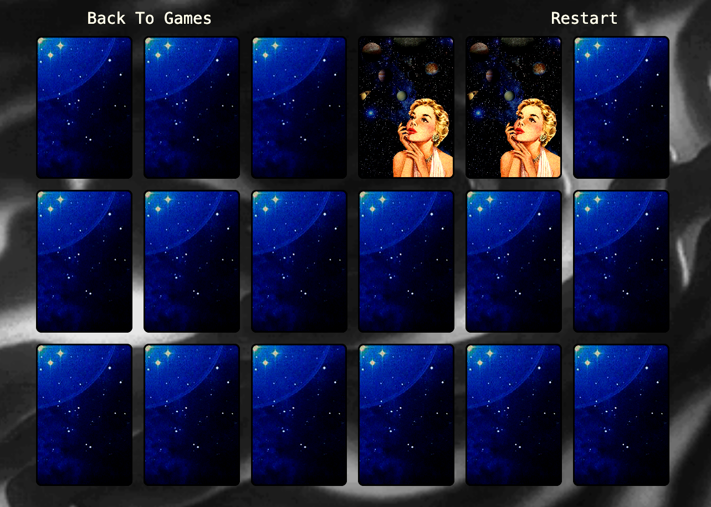

# Concentration Game

## Overview

This project is a React.js implementation of the classic Concentration game, also known as Memory. The game challenges players to match pairs of cards by flipping them over, testing their memory and concentration skills.

## Features

- **Randomized Card Layout:** Cards are shuffled and placed randomly at the beginning of each game to ensure a unique experience every time.
- **Card Flip Animation:** Smooth animations when cards are flipped, enhancing the visual appeal and user experience.
- **Match Detection:** The game automatically detects when two flipped cards match and keeps them flipped if they do.
- **Game Controls:** The user can restart the game at any time or navigate back to the games menu.
- **Responsive Design:** The game board adapts to various screen sizes for an optimal playing experience.

## Project Structure

The project consists of several main components and files:

- **`Concentration.jsx`**: The main component that handles the game logic, including shuffling cards, detecting matches, and managing game state.
- **`ConCard.jsx`**: A card component that handles the rendering and flipping logic for individual cards using `react-card-flip`.
- **`Concentration.css`**: Stylesheet containing the visual design for the game.

## Gameplay

The objective of the game is to find all matching pairs of cards:

1. Click on a card to flip it over.
2. Click on a second card to flip it over.
3. If the two cards match, they remain flipped. If they do not, they flip back over.
4. The game ends when all pairs have been matched.



## Technical Details

### Card Shuffling

The cards are shuffled using the `shuffleCards` function, which randomizes their order and resets the game state. The shuffled cards are then stored in the component's state.

### State Management

- **`cards`**: An array representing the deck of cards, including their flip and match status.
- **`flippedCards`**: Tracks the indices of the currently flipped cards to determine if a match is found.
- **`matches`**: A counter tracking the number of matches found.
- **`isChecking`**: A flag to prevent interaction while checking for matches.
- **`backToGames`**: A flag to handle navigation back to the games menu.

### Card Component

The `ConCard.js` file defines the `ConCard` component, which handles the visual representation of each card. The component utilizes the `react-card-flip` library to manage the flipping animation when cards are clicked.

#### Key Features:

- **`ReactCardFlip`:** A component from the `react-card-flip` library used to create smooth card flip animations.
- **Flip State Management:** The component receives the card's flip state (`isFlipped`, `isMatched`) as props and applies appropriate styles and animations.
- **Dynamic Styling:** The card's background image is dynamically set based on its content, ensuring the correct image is displayed when the card is flipped.

### Match Detection

When two cards are flipped, the `checkForMatch` function compares their content. If a match is found, the cards remain flipped. If not, they are flipped back after a brief delay.

### Navigation

The game includes a "Back to Games" button that utilizes React Router's `Navigate` component to return the user to the games menu.

## Styling

The `Concentration.css` file defines the visual style and layout of the game:

- **Overall Layout**: The game occupies the full height of the viewport, with the backdrop image centered and filling the background. The game board is centered both horizontally and vertically, providing a visually balanced interface.
- **Game Board**: The game board is a responsive grid that adjusts based on the viewport size. It consists of a 6x3 grid of cards with adequate spacing between them to ensure clarity.

- **Card Styles**: Each card is styled with a black background and a contrasting border. When flipped, the card displays its respective image. The `ReactCardFlip` component handles the flipping animation.

- **Buttons**: The control buttons (`Back To Games`, `Restart`) have a minimalist design with a hover effect that extends an underline, giving visual feedback to the user.

```css
.card {
  background-image: url("../../../Images/Games/Concentration/Background-28.jpg");
  background-position: center;
  border-radius: 10px;
  cursor: pointer;
  user-select: none;
  aspect-ratio: 2 / 3;
  background-color: rgb(9, 4, 31);
  border: solid black 3px;
}

.card.flipped {
  background-size: cover;
}

.card.not-flipped {
  background-image: url("../../../Images/Games/Concentration/Background-28.jpg");
}


The styling ensures the game is visually appealing while being responsive and user-friendly.

```
