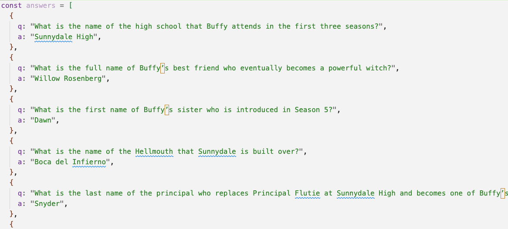
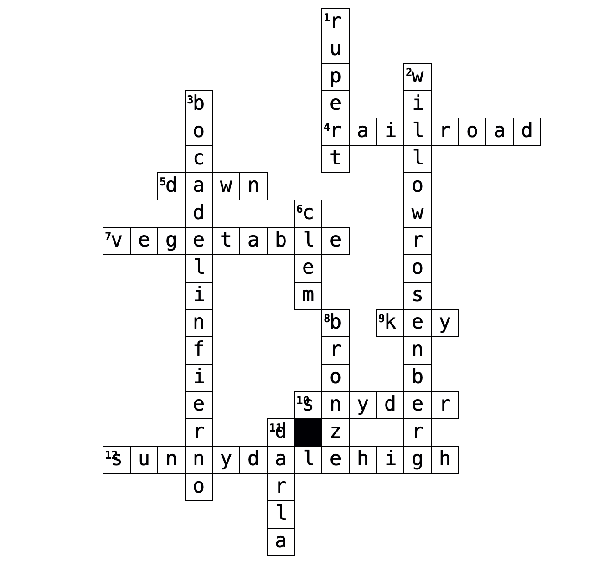
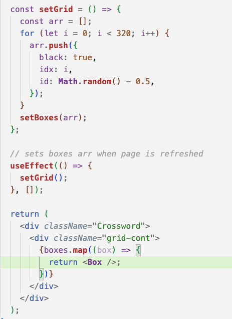
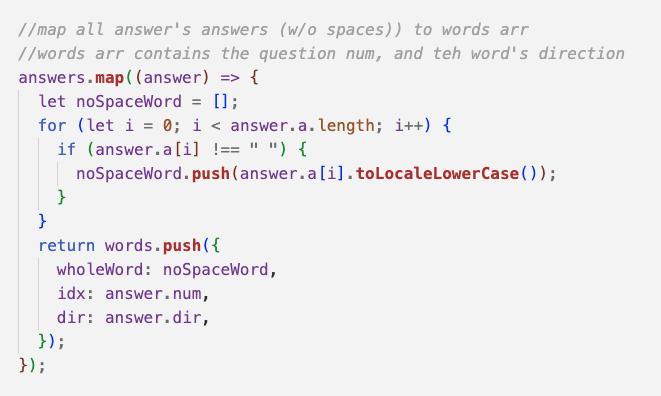
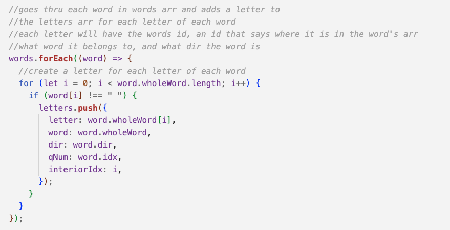

<h1>How I Created my Buffy Themed Crossword Puzzle.</h1>
<h1>👱‍♀️🧛👹</h1>

1. First I wrote all my questions and answers in form of an object, and created the initial layout of my puzzle.
   
2. I determined I would need a grid 16 by 20, so I displayed that using map.
   
   
    
3. Next I created an arr of objs to hold all the letters data. I iterated through my answers array extracting
   the info I needed (like the answer and its direction). Then I did that again creating an arr of letters from that
   previous words arr.

   
   
