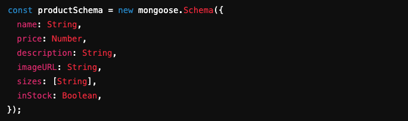
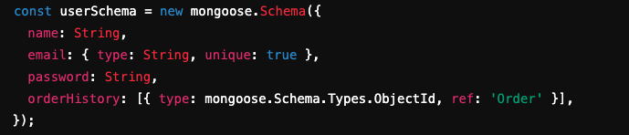
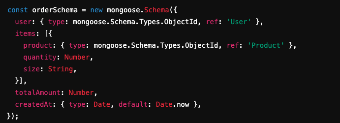

# Evie & Co. - High-End Online Fashion Shop

This project is a **React.js-based e-commerce platform** for a high-end online fashion shop. The shop features an elegant, London-inspired aesthetic that combines mod, Victorian, and punk styles. Users can browse, shop, and manage their accounts with a sleek and intuitive user experience.

---

## Medium Blog Posts:

[https://medium.com/@erinmontybruce/schema-and-the-city-when-code-breaks-and-so-does-your-heart-c383e18687aa](https://medium.com/@erinmontybruce/schema-and-the-city-when-code-breaks-and-so-does-your-heart-c383e18687aa)

[https://medium.com/@erinmontybruce/how-to-build-a-goblin-store-with-react-express-and-mongodb-1ef3f99d43f7](https://medium.com/@erinmontybruce/how-to-build-a-goblin-store-with-react-express-and-mongodb-1ef3f99d43f7)

## 1. Overview and User Walkthrough

### Shop Overview:

Evie & Co. is an online fashion boutique that allows users to browse through a variety of products, add items to their cart, and complete purchases. The app supports user authentication and a dynamic shopping experience with a backend powered by MongoDB.

### User Walkthrough:

- **Homepage**: When users visit the homepage, they are greeted with a carousel displaying featured products. They can explore various categories like New Arrivals, Best Sellers, and Sale Items.
- **Browsing the Shop**:
  - **Viewing Products**: Users can scroll through the shop, which displays product cards showing the name, price, and available sizes of each item. Clicking on a product brings up detailed information, including more images and product descriptions.
  - **Adding to Cart**: Users can add items to their cart by selecting a size and clicking the "Add to Cart" button.
- **Managing the Cart**:

  - **Viewing the Cart**: The cart page shows all selected items, with quantities, sizes, and total price.
  - **Updating Quantities**: Users can adjust the quantity of items in the cart or remove items entirely.
  - **Proceeding to Checkout**: After reviewing the cart, users can proceed to checkout, where they’ll provide shipping information and finalize their purchase.

- **User Authentication**:

  - **Account Creation and Login**: Users can register or log in to access their purchase history and save items for future reference. After logging in, they are redirected to the shop to continue their shopping experience.

- **Order Confirmation**:
  - Once an order is completed, the user receives an email confirmation, and their order is saved to their account's purchase history.

---

## 2. Technologies and Techniques Used

### Technologies:

- **React.js**: Manages the component-based structure of the front end and handles the user interface.
- **MongoDB & Mongoose**: Handles user and product data in a NoSQL database with schema-based modeling.
- **Express.js & Node.js**: Backend framework and server runtime environment for handling API requests and user authentication.
- **CSS**: Provides a custom, responsive layout with styles suited to a modern fashion brand.

### Techniques:

- **State Management**:

  - **useState** and **useEffect**: Used to manage the dynamic aspects of the shop such as cart contents, user sessions, and product data.

  ```javascript
  const [cartItems, setCartItems] = useState([]);
  const [user, setUser] = useState(null);
  const [products, setProducts] = useState([]);
  ```

### MongoDB Schemas:

1. Product Schema :
   
2. User Schema :
   
3. Order Schema :
   

## 3. Installation & Setup

To set up the project locally:

1. Clone the repository:
   ```bash
   git clone <repository-url>
   ```
2. Install dependencies:
   ```bash
   cd concentration-game
   npm install
   ```
3. Run the project:
   ```bash
   npm start
   ```
4. Access the game at `http://localhost:3000`.

---

## 4. Contributing

If you'd like to contribute to the project, please fork the repository and create a pull request with your changes.
